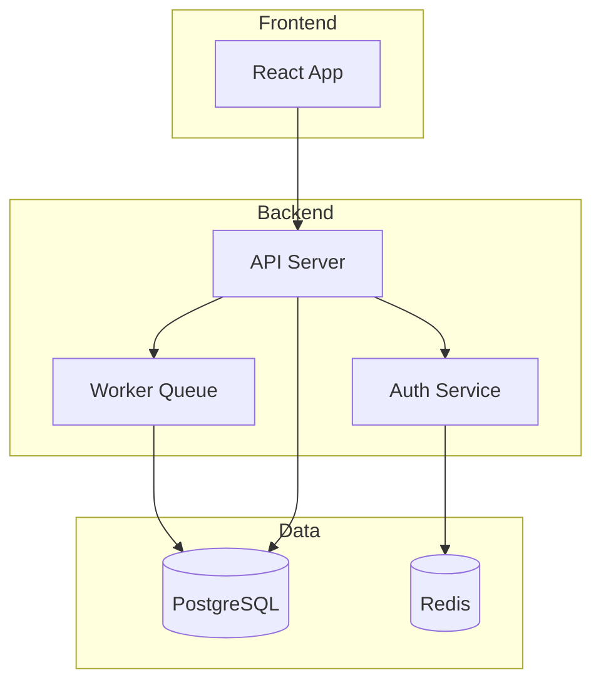
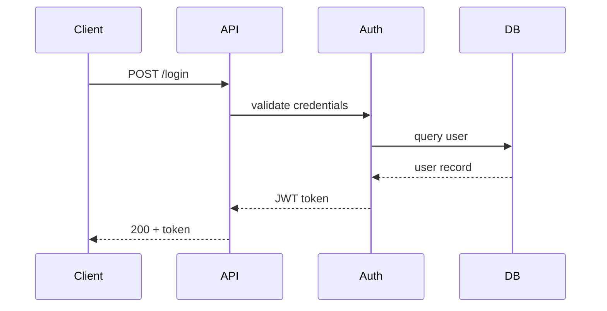

# Project Wiki Operations — Detailed Reference

## Init (Bootstrap) Workflow

First-time setup — scan the codebase and build initial wiki:

1. **Scan codebase structure:**
   - List all directories and key files
   - Identify languages, frameworks, build tools
   - Read `package.json`, `Cargo.toml`, `pyproject.toml`, etc.
   - Note directory conventions (src/, lib/, tests/, docs/)

2. **Read existing documentation:**
   - README.md, CLAUDE.md, CONTRIBUTING.md
   - Inline doc comments in key files
   - Config files (CI/CD, deployment, environment)
   - Git history — `git log --oneline -30` for recent context

3. **Write overview.md:**
   ```yaml
   ---
   title: Project Overview
   type: overview
   created: YYYY-MM-DD
   updated: YYYY-MM-DD
   ---
   ```
   Content: project purpose, tech stack, architecture summary, directory layout, key decisions, deployment info. Include a top-level mermaid diagram:
   ```mermaid
   graph TD
     A[Client] --> B[API Gateway]
     B --> C[Auth Service]
     B --> D[Core Service]
     D --> E[Database]
   ```

4. **Create entity pages** for major components:
   - One page per service, module, or major file group
   - Format: `entities/<component-name>.md`
   - Include: purpose, key files, public API/exports, dependencies, related entities
   ```yaml
   ---
   title: User Service
   type: entity
   tags: [backend, auth]
   created: YYYY-MM-DD
   updated: YYYY-MM-DD
   related_files: [src/services/user.ts, src/models/user.ts, src/routes/users.ts]
   ---
   ```

5. **Create concept pages** for architectural patterns:
   - One page per pattern or cross-cutting concern
   - Format: `concepts/<pattern-name>.md`
   - Examples: auth-flow, error-handling, data-validation, testing-strategy, deployment-pipeline
   - Include: how it works, which files implement it, mermaid flow diagram, gotchas
   ```yaml
   ---
   title: Authentication Flow
   type: concept
   tags: [auth, security]
   created: YYYY-MM-DD
   updated: YYYY-MM-DD
   related_files: [src/middleware/auth.ts, src/services/token.ts]
   ---
   ```

6. **Create index.md and log.md**, add wiki reference to CLAUDE.md

## Ingest (Code Changes) Workflow

When code has changed since last wiki update:

1. **Detect changes:**
   - During active session: track which files were written/edited
   - On session start: `git diff --name-only` since last log.md date
   - Classify each change as structural or trivial

2. **Structural changes to document:**
   | Change type | Wiki action |
   |---|---|
   | New module/service | Create entity page |
   | Deleted module | Remove entity page, update cross-refs |
   | Renamed file/module | Update entity page, fix all `related_files` |
   | New API endpoint | Update entity page, add to relevant concept |
   | Changed data model | Update entity page, flag potential cascading changes |
   | New pattern introduced | Create concept page |
   | Dependency added/removed | Update overview.md tech stack |
   | Config change | Update relevant entity or concept page |
   | Architecture change | Update overview.md, mermaid diagrams |

3. **Trivial changes to skip:**
   - Formatting, linting fixes
   - Comment-only changes
   - Test data updates
   - Version bumps (unless major)
   - Typo fixes

4. **For each structural change:**
   - Read the changed files
   - Update the relevant entity or concept page
   - Check if cross-references need updating
   - Update mermaid diagrams if flows changed
   - Update overview.md if it's an architectural shift

5. **Update index.md** with new/modified pages
6. **Append to log.md:**
   ```markdown
   ## [2026-04-04] ingest | Refactored auth middleware
   - Trigger: 5 files changed in src/middleware/
   - Pages updated: entities/auth-middleware.md, concepts/auth-flow.md
   - Pages created: entities/token-service.md
   - Total pages touched: 4
   ```

## Query Workflow

When the user asks about the project:

1. **Read index.md** — find relevant wiki pages
2. **Read wiki pages** — follow cross-references for connected info
3. **Read source code if needed** — for details beyond what the wiki captures
4. **Synthesize answer:**
   - Cite wiki pages: `According to [Auth Flow](concepts/auth-flow.md)...`
   - Cite source code: `See src/middleware/auth.ts:42`
   - Include relevant mermaid diagrams
   - Note if wiki might be stale on this topic
5. **File valuable answers:**
   - Architecture comparisons → `queries/`
   - "How does X interact with Y" synthesis → `queries/`
   - Simple "where is X" lookups → don't file
6. **Append to log.md:**
   ```markdown
   ## [2026-04-04] query | How does the auth middleware chain work?
   - Pages consulted: concepts/auth-flow.md, entities/auth-middleware.md
   - Source files read: src/middleware/auth.ts, src/middleware/session.ts
   - Answer filed: queries/auth-middleware-chain.md
   ```

## Lint Workflow

Verify wiki accuracy against current codebase:

1. **Check entity pages against filesystem:**
   - Do all `related_files` still exist? (files may have been renamed/deleted)
   - Are there major source files not covered by any entity page?
   - Do entity descriptions match current code behavior?

2. **Check concept pages against implementation:**
   - Are pattern descriptions still accurate?
   - Have flows changed without wiki updates?
   - Are mermaid diagrams still correct?

3. **Check overview.md:**
   - Is tech stack current? (check package.json/lock files)
   - Is architecture description accurate?
   - Is directory layout description current?

4. **Cross-reference integrity:**
   - Are all wikilinks valid?
   - Are there orphan pages?
   - Are there heavily-referenced entities without their own page?

5. **Report and fix:**
   ```markdown
   ## [2026-04-04] lint | Codebase sync check
   - Stale references: entities/old-service.md references deleted file
   - Undocumented: src/services/new-feature.ts has no entity page
   - Outdated diagram: auth flow in concepts/auth-flow.md missing new OAuth step
   - Fixed: removed stale reference, created entity stub for new-feature
   - Needs attention: auth flow diagram needs manual review
   ```

## Mermaid Diagram Conventions

Use for architecture overviews and flow diagrams:





Keep diagrams focused — one concept per diagram. Link to the diagram from related entity/concept pages.
